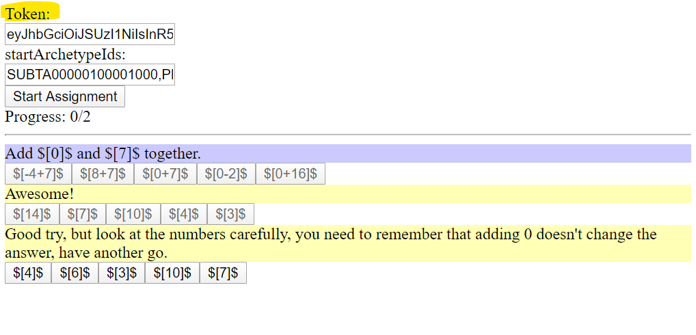

# web-examples

Example implementation of the AMY UI by using the AMY.APP API



## Test directly here on GitHub
- React implementation https://amy-app.github.io/web-examples/examples/react.html
- Vanilla JS implementation https://amy-app.github.io/web-examples/examples/vanilla.html

## Start webserver

To start the example project all you need to do is run a local webserver in the `examples` folder. For example: `npx serve`. This will serve your local project on port `5000`. Now you can open the example page via http://localhost:5000/vanilla or http://localhost:5000/react

## Get user token

To allow a user to interact with Amy the user needs a user Token. You can generate a user token via our API at https://api.amy.app . Under point `Auth` you will find `/v2.0/auth/generate-student-token`.
You will need two parameters: `api_key` and `student_id`.

The return value will be a JSON looking like this

```
{
    token: "long token string",
    amy_student_id: "Jaipuna_schoolDemo_user1",
}
```

For some quick testing you can use our example login data:

```
api_key: f25cc439c4a7aa8d7ea06f0d01e2b8116732a594b1547117dcc9641a91940823ed22b671ca07c56ea58f820bb2f0aa5ea74f612fc157a2761526e053fd493d0707f19216dcf7b24184c3da2970b7ad23f54f225c3be2612cf72bc6dfdd003ce898aaf0153cba8d2fb97caffc4f35bd718e7fd95f723341fdd83363ff34a48030
user_id: demoUser1
```

