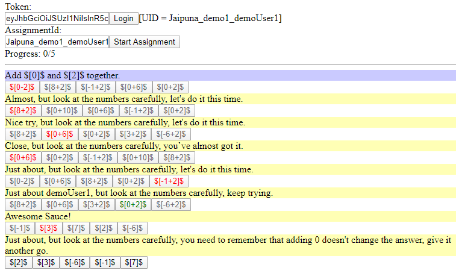

# Amy.app web-examples-implementation

Example implementation of the AMY UI by using the AMY.APP API



## Test directly here on GitHub
- React implementation https://amy-app.github.io/web-examples/examples/react.html
<!-- - Vanilla JS implementation https://amy-app.github.io/web-examples/examples/vanilla.html -->

## Start webserver

To start the example project all you need to do is run a local webserver in the `examples` folder. For example: `npx serve`. This will serve your local project on port `5000`. Now you can open the example page via http://localhost:5000/vanilla or http://localhost:5000/react

## Get student token

To allow a student to interact with Amy the student needs a token. You can create a token via our API at https://api.amy.app . Under point `Auth` you will find `/v2.0/auth/create-student-token`.
You will need two parameters: `api_key` and `student_id`.

The return value will be a JSON looking like this

```
{
  "status": "SUCCESS",
  "message": null,
  "data": {
    "token": "long token string",
    "student_id": "Jaipuna_demo1_demoStudent1"
  }
}
```


## Get assignment Id

To allow a student to work through an assignment you have to first make the assignment. You can do this via the `/v2.0/amy/create-student-assignment` endpoint. This API will return a `student_assignment_id` which you need for loading the assignment. 

The return value will be a JSON looking like this

```
{
  "status": "SUCCESS",
  "message": null,
  "data": {
    "student_assignment_id": "some assignment id"
  }
}
```

The following are some example `arch_ids` you can use in the `arch_id` section: `PLUSA00000100001000, FRAC00130`. More `arch_ids` can be found in the Amy explorer: https://learn.amy.app/explorer/root/MATH0000000001


## Demo login

For some quick testing you can use our example login data:

```
api_key: f25cc439c4a7aa8d7ea06f0d01e2b8116732a594b1547117dcc9641a91940823ed22b671ca07c56ea58f820bb2f0aa5ea74f612fc157a2761526e053fd493d0707f19216dcf7b24184c3da2970b7ad23f54f225c3be2612cf72bc6dfdd003ce898aaf0153cba8d2fb97caffc4f35bd718e7fd95f723341fdd83363ff34a48030
student_id: demoStudent1
```